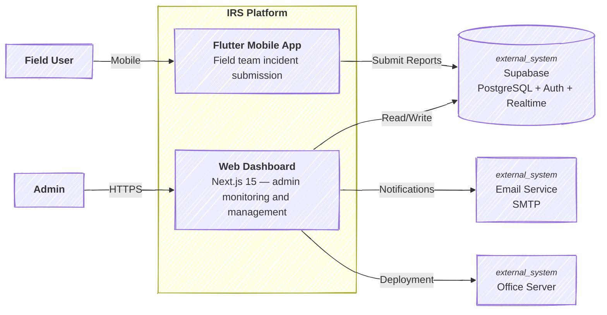
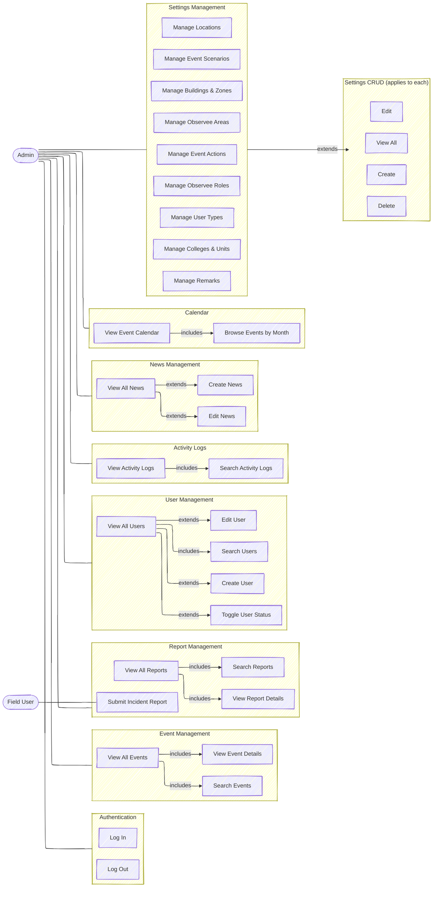
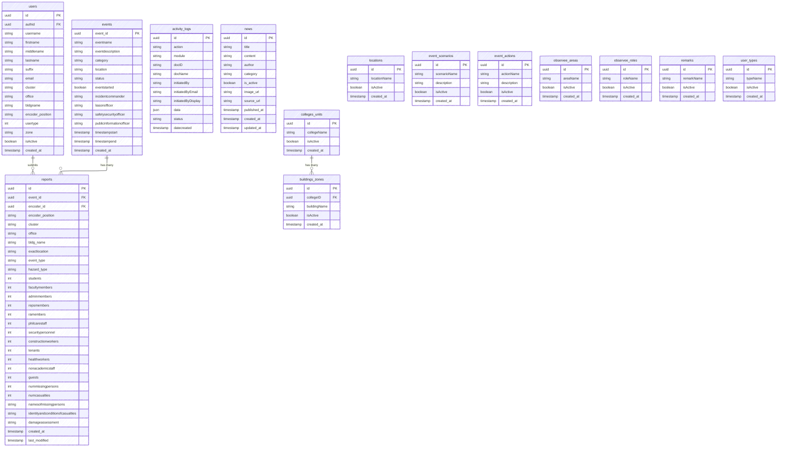
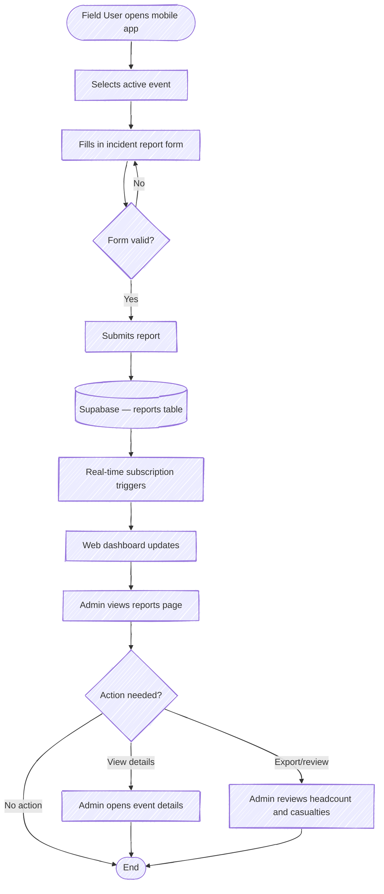

# UPM DRRM-H — Incident Reporting System

[](https://nextjs.org/)
[](https://www.typescriptlang.org/)
[](https://supabase.com/)
[](https://tailwindcss.com/)
[](https://opensource.org/licenses/MIT)

## **Web Dashboard for the UP Manila Disaster Risk Reduction and Management in Health Incident Reporting System**

---

## About

This is the **admin web dashboard** for the UPM DRRM-H Incident Reporting System — a platform designed to manage, monitor, and analyze incident reports submitted by field teams across the UP Manila campus during drills, emergencies, and other DRRM-H-related events.

The system works alongside a companion Flutter mobile app used by field personnel to submit real-time reports. Data flows from the mobile app into Supabase, and this dashboard gives administrators a centralized view of all incidents, headcounts, drill statuses, and post-event summaries.

### What it does

- **Dashboard** — Live stats on events, reports, and affected personnel
- **Events** — Track drills and incidents from start to resolution
- **Reports** — View and search submitted field reports with headcount breakdowns
- **Activity Logs** — Full audit trail of all system actions
- **Users** — Manage field team accounts and access levels
- **Calendar** — Visual timeline of events per month
- **News** — Post announcements and advisories
- **Settings** — Configure scenarios, locations, buildings, roles, and more

### System Context

The IRS is part of a broader DRRM-H platform consisting of:

| Component          | Description                    |
| ------------------ | ------------------------------ |
| **This repo**      | Admin web dashboard (Next.js)  |
| Flutter mobile app | Field team incident submission |
| Supabase           | Shared backend and database    |

---

## Tech Stack

| Category               | Technology                   |
| ---------------------- | ---------------------------- |
| **Framework**          | Next.js 15 (App Router)      |
| **Language**           | TypeScript                   |
| **Styling**            | Tailwind CSS v4              |
| **Database & Auth**    | Supabase                     |
| **State Management**   | Zustand                      |
| **Data Fetching**      | TanStack Query (React Query) |
| **Forms & Validation** | React Hook Form + Zod        |
| **Charts**             | Recharts                     |
| **Notifications**      | React Hot Toast              |
| **Icons**              | Lucide React                 |

---

## Setting It Up

### Prerequisites

- Node.js v18 or higher
- A Supabase project with the IRS schema set up

### Installation

1; **Clone the repository**

```bash
git clone https://github.com/your-org/upm-drrm-irs.git
cd upm-drrm-irs
```

2; **Install dependencies**

```bash
npm install
```

3; **Set up environment variables**

```bash
cp .env.local.example .env.local
```

Then fill in your Supabase credentials in `.env.local`:

```env
NEXT_PUBLIC_SUPABASE_URL=https://yourproject.supabase.co
NEXT_PUBLIC_SUPABASE_ANON_KEY=your-anon-key
```

4; **Start the development server**

```bash
npm run dev
```

Open [http://localhost:3000](http://localhost:3000) in your browser.

---

## Project Structure

```bash
src/
├── app/                    # Next.js App Router pages
│   ├── (admin)/            # Protected admin routes
│   │   ├── page.tsx        # Dashboard
│   │   ├── events/         # Events management
│   │   ├── reports/        # Incident reports
│   │   ├── users/          # User management
│   │   ├── activity-logs/  # Audit logs
│   │   ├── calendar/       # Event calendar
│   │   ├── news/           # Announcements
│   │   └── settings/       # System configuration
│   └── (auth)/             # Auth pages (signin)
├── components/
│   ├── auth/               # Auth components and protected route
│   ├── layout/             # Sidebar, header, backdrop
│   ├── ui/                 # Base UI components
│   ├── settings/           # Reusable settings table/form
│   ├── users/              # User form
│   └── news/               # News form
├── hooks/                  # React Query data hooks
├── lib/                    # Supabase client, utils, schemas, logger
├── store/                  # Zustand stores (auth, sidebar, theme)
└── types/                  # TypeScript database types
```

---

## Roles & Access

| Role            | Access                                                        |
| --------------- | ------------------------------------------------------------- |
| **Admin**       | Full web dashboard access — all data, charts, user management |
| **Field Users** | Mobile app only — submit reports per assigned team role       |

Field team roles include: Proprietor, Security, Search & Rescue, Medical, Fire Marshal. Each role sees only their own submitted data through the mobile app.

---

## System Architecture Diagram



## Use-Case Diagram



## Entity Relationship Diagram



## Flowchart Diagram



---

## Scripts

```bash
npm run dev        # Start development server
npm run build      # Build for production
npm run start      # Start production server
npm run lint       # Run ESLint
npm run lint:fix   # Auto-fix ESLint issues
```

---

## Developer

**Bryan Mangapit** — Lead Developer
**Sharah Tuando** — Frontend Design Specialist
[bruhhhyannnn.framer.website](https://bruhhhyannnn.framer.website) · [GitHub](https://github.com/bruhhhyannnn) · [LinkedIn](https://linkedin.com/in/bryanmangapit)

---

## License

MIT © 2026 Bryan Jesus Mangapit · UP Manila DRRM-H
